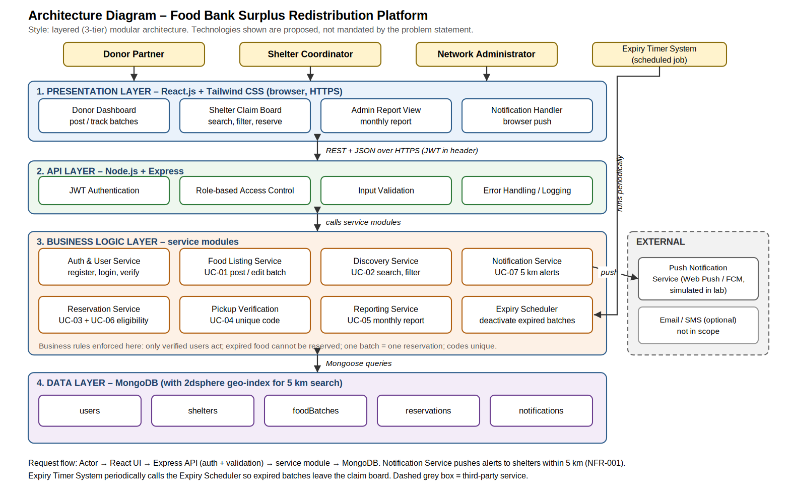

# MyProject_FoodBankSurplus – Food Bank Surplus Redistribution Platform

**Student:** Manoj Shrikant Gaonkar | **SRN:** PES1UG25CS827 | **Section:** H | **Faculty:** Ambika K  
**Course:** Software Engineering, PES University, Dept. of CSE | **Problem Statement:** #62 – Sustainability & Green Tech

## Problem Statement
A food rescue platform where restaurants and grocery stores post surplus edible food batches, and verified local shelters reserve pickup windows before food expiry.

**Actors:** Donor Partner, Shelter Coordinator (official). Network Administrator and Expiry Timer System are added in the Lab 1 diagram.

## Repository Structure
| Folder | Contents | Status |
|---|---|---|
| [1_RE](1_RE/) | Requirements table (5 FR + 2 NFR), RTM, UML use-case diagram, use-case flow specification | Done |
| [2_Architectural_Diagram](2_Architectural_Diagram/) | Layered architecture diagram | Done |
| [3_Screenshots_GitHub_Jira](3_Screenshots_GitHub_Jira/) | Lab 2 Kanban, Scrum, Bug Tracking PDFs + GitHub/Jira screenshots | Done |
| [4_SRS_and_WBS](4_SRS_and_WBS/) | SRS and Work Breakdown Structure | Done |
| [5_GitHub_Copilot_Code](5_GitHub_Copilot_Code/) | Copilot-generated code screenshots / repo link | Done|
| [6_Software_Testing_Tools](6_Software_Testing_Tools/) | Bug fix and retest of the shared game application | To do |

